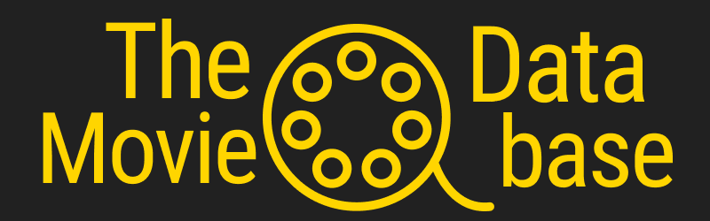
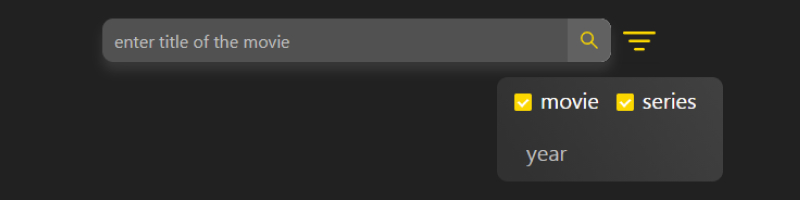
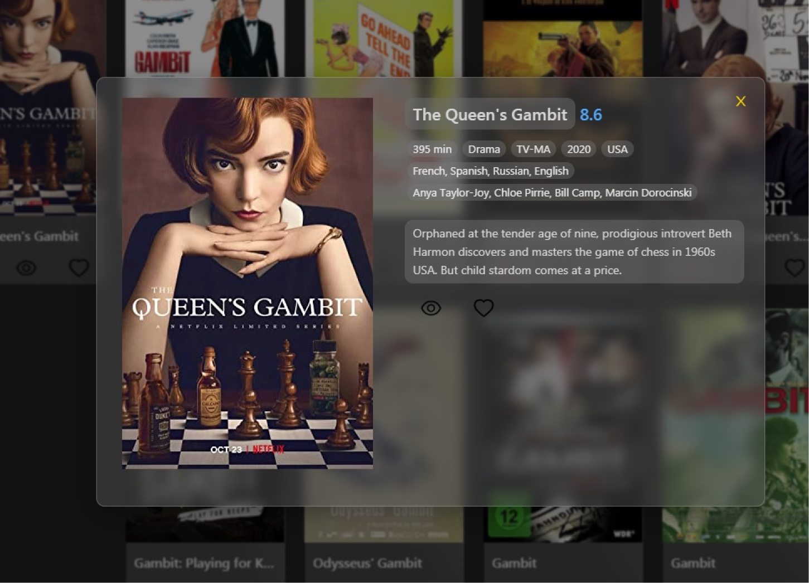
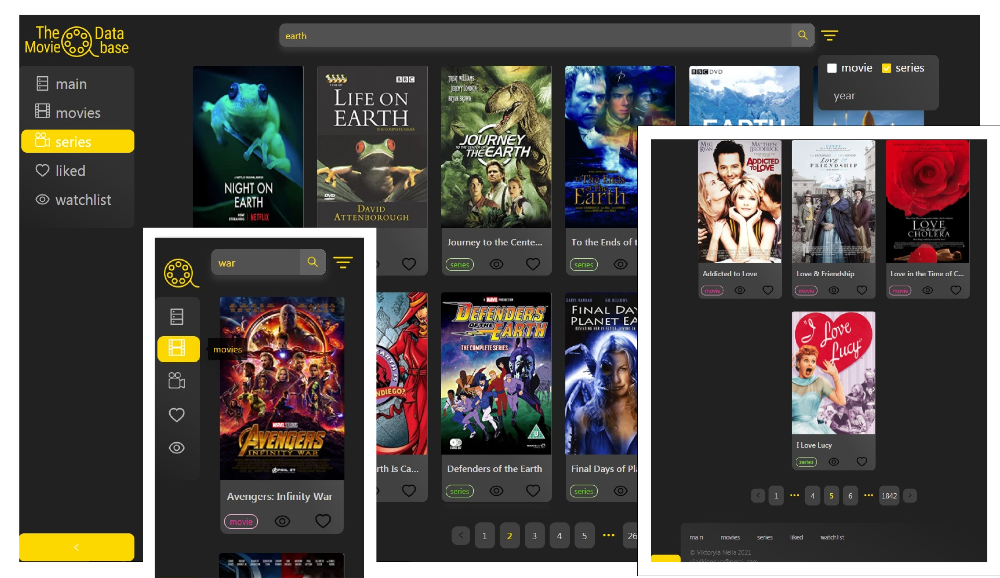

<h1 align="center">The Movie Database</h1>

<h2 align="center"><a  href="https://vikylkinnelya.github.io/movie-database/">Try it</a></h2>

## Description 

**Find** 
 * the movie you are looking for
 * something new by random

**Take a look**
 * description
 * genre
 * actors
 * duration
 * reviews
 * other

## About the project
 * The movie database uses [OMDb API](http://www.omdbapi.com/) to obtain movie information.
 * Design and UI were created by using [Ant Design](https://ant.design/).
 * For navigation between pages there is [React Router](https://reactrouter.com/web/guides/quick-start).
 * Responsive design:
 

## Future scope
 * Optimization 
